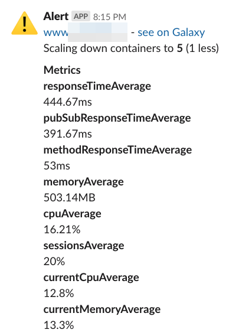
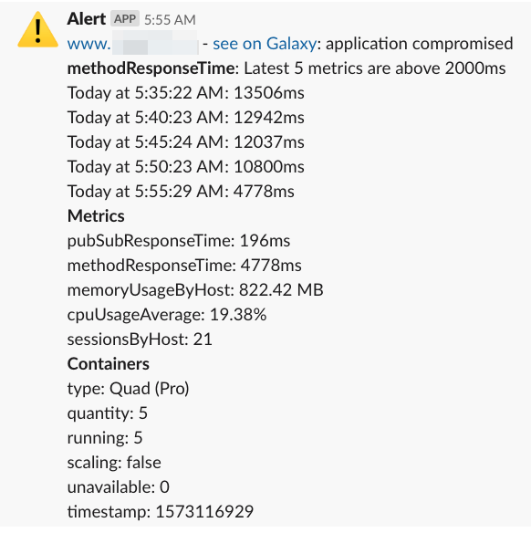
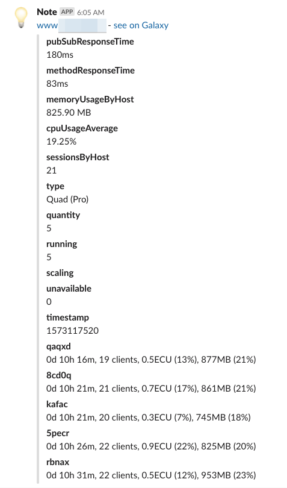

# Galaxy Bot (galaxy-bot)
NodeJS command line tool to monitor and auto-scale Meteor [Galaxy](https://www.meteor.com/hosting)

## Disclaimer: galaxy-bot is not ready for use yet but will be soon :)

## Features
- Monitoring: reads Galaxy metrics
- Alerts: reports containers and apps not running as expected
- Auto-scaling: take actions when specific conditions are met
- Send slack notifications: updates, alerts and autos-scaling messages;

## How it works
We use Galaxy public API to read Galaxy dashboards and then we execute actions based on
 your
 desired settings.
 
## How to use
Set up in your CI server or equivalent a job to call `galaxy-bot` (galaxy-bot) command
 from
 time to time, it's probably a good idea to use a very short period, like every 2 minutes then
  you will be always monitoring your containers.
  
  If you need help configuring your CI check [our configurations examples](./CI.md). Please open
   an issue if you are having a hard time then we can improve the documentation. If
   you have already configured your CI please open a Pull Request including the instructions in the
    configuration examples.
  
First you need to install `galaxy-bot` (galaxy-bot) using yarn or npm: 
```
yarn global add @quave/galaxy-bot
``` 
```
npm install -g @quave/galaxy-bot
```

Then you run it informing a configuration file with your alerts and auto-scaling rules:
```
galaxy-bot --settings settings.json
```
You can have different settings for different purposes.


## Updates
Check the [log of changes](./CHANGELOG.md).

## Settings

Most fields are self-explanatory.

- variables
  - hostname: your app name on Galaxy
  - seriesName: you can use `5s`, `3m`, `1h` or `1d`
  - limit: how many metrics do you want to analyze

```json
{
  "galaxyUrl": "Galaxy API URL (required)",
  "apiKey": "your Galaxy API Key (required)",
  "variables": {
    "hostname": "staging.bemarke.com",
    "seriesName": "3m",
    "limit": 5
  },
  "slackWebhook": "your Slack webhook URL",
  "silentSlack": false,
  "simulation": false,  
  "infoRules": {
    "send": true,   
    "channel": "#galaxy-updates"
  },
  "alertRules": {
    "channel": "#alerts",
    "messagePrefix": "@channel",
    "maxInApp": {
      "cpuUsageAverage": 1,
      "memoryUsageByHost": 1500,
      "sessionsByHost": 5
    }
  },
  "autoscaleRules": [{
    "channel": "#auto-scaling",
    "containersToScale": 2,
    "minContainers": 2,
    "maxContainers": 10,
    "addWhen": {
      "$or": true,
      "cpuPercentageAbove": 50,
      "memoryPercentageAbove":  70,
      "connectionsAbove":  50
    },
    "reduceWhen": {
      "cpuPercentageBelow": 25,
      "memoryPercentageBelow": 25,
      "connectionsBelow": 30
    }
  }],
}

```

## Auto scale rules

The autoscaling (`autoscaleRules`) behavior is meant to adjust smartly the containers on the
 Galaxy server taking
 into account the data got from there and a predefined configuration.

- Three actions are supported:
  - `add` containers (conditions are configured on `addWhen` json key);
  - `reduce` containers (conditions are configured on `reduceWhen` json key);
  - `kill` containers (conditions are configured on `killWhen` json key);

- The conditions available are: "[cpuPercentage|memoryPercentage|connections][Above|Below]". Check out to which values refer for each: [from Galaxy Panel](https://user-images.githubusercontent.com/2581993/68477766-26baa380-0226-11ea-81da-c0b635f717d6.png).

- The conditions express the property average on the active containers. The active containers are
 those that are running, the ones starting or stopping are ignored.

- Multiple conditions can be informed and they are evaluated by default as and, it means, all must match to execute the action. You can change this behavior adding `"$or": true` to your rule.

- The `addWhen` and `reduceWhen` behaviors check to not go beyond a containers count range. This range is described by the `minContainers` and `maxContainers` configuration. They are required if you are using `addWhen` or `reduceWhen`.

- The `addWhen` and `reduceWhen` behaviors won't run if a scaling is happening. If any other condition passes it will run on the next run.

- The `killWhen` will run if a scaling is happening. If any other condition passes it will run on the next run.

- An slack message is sent anytime a scaling behavior is triggered if you set a Slack Webhook, the
 messages are sent to the default webhook channel. You will receive messages like this
 


## Alerts
You can set maximum limits for container metrics (CPU, memory and connected clients).

Example:
```
"alertRules": {
    "maxInApp": {
      "cpu": 60,
      "memory": 70,
      "connections": 1000
    }
},
```
You will receive an alert like this when at least `minimumStats` times in a row the current value
 was above the maximum expected.



  Then if you run `galaxy-bot` every 2 minutes and use `minimumStatus
  ` as 5 you will get an alert when your metric is at least 10 minutes above the maximum expected
  . 
 
 `minimumStats` is set in the first level of the settings because maybe we will use this
  information in
  the future also for auto-scaling, for now auto-scaling is not considering the `minimumStats`
   value.
 
## Info rules
- Set the channel, by default will go to default webhook channel
- You will receive messages like this



## Advanced
### Remote settings
If you need to have dynamic settings coming from a external location, like an API, you can
 configure: 
 ```json
"remote": {
    "url": "https://yourapi.com/v1/auto-scaling?yourkey=XXX&anySetting=YYY"
}
```
Then the JSON returned by this API will be merged (using `lodash.merge`) with your local settings
. If the request to this URL throws an error then the local settings will be used anyway and a
 `console.error` (`Error getting remote options from ${url}`)
 will be printed.

## LICENSE 
[MIT](LICENSE)
